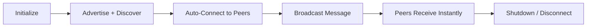

<div align="center">


# AlphaConnection

### 📡 Offline Peer-to-Peer Communication for Android

A Proof-of-Concept Android application demonstrating **reliable local broadcast communication** between nearby Android phones using the **Google Nearby Connections API**.
**No internet. No servers. No limits.**

<br/>

[](https://kotlinlang.org)
[](https://developer.android.com)
[](https://developer.android.com)
[](LICENSE)

<br/>

<a href="https://drive.google.com/file/d/13DeGHHdcbN_2ygfi8pLDwhJ2rjUNxPp8/view?usp=sharing">
  
</a>

<sub>Debug build · Android 8.0+ required · No Play Store needed</sub>

</div>

<br/>

---

## ✨ Overview

<table>
<tr>
<td width="60%" valign="top">

**AlphaConnection** lets two or more Android phones discover each other and exchange messages **directly** — no Wi-Fi router, no mobile data, no cloud server in the middle.

Under the hood, it rides on Google's **Nearby Connections API**, which automatically negotiates between **Bluetooth** and **Wi-Fi Direct** to find the fastest, most reliable link between devices.

Think of it as a lightweight, DIY version of AirDrop — built from scratch in Kotlin, fully open source, and easy to extend.

</td>
<td width="40%" valign="top">

```
   📱  ⇆  📱
 Phone A    Phone B
    │           │
    └── Bluetooth /
        Wi-Fi Direct ──┘
        (zero internet)
```

</td>
</tr>
</table>

---

## 🚀 Features

<table>
<tr>
<td width="33%" align="center">

### 🔌
**Zero Internet**
Fully offline. No servers, no APIs, no data plans required.

</td>
<td width="33%" align="center">

### ⚡
**Auto-Discovery**
Devices find and connect to each other automatically nearby.

</td>
<td width="33%" align="center">

### 📨
**Live Broadcasting**
Send text instantly to every connected device in real time.

</td>
</tr>
</table>

---

## 🏗️ Architecture

<div align="center">

| Class | Responsibility |
|:--|:--|
| `SplashActivity` | Splash screen with fade-in animation |
| `MainActivity` | Main UI — controls, message list, connection log |
| `LocalBroadcastService` | Public API wrapper — `initialize()` · `broadcast()` · `onReceive()` · `shutdown()` |
| `NearbyManager` | Low-level Google Nearby Connections wrapper |
| `MessageAdapter` | RecyclerView adapter for message rendering |
| `MessageModel` | Data class — text, timestamp, direction |

</div>

### Core API

```kotlin
initialize()                    // Start advertising + discovery
broadcast(data: String)         // Send message to all connected devices
onReceive(data: String)         // Callback fired when a message arrives
shutdown()                      // Tear down all connections
```

### Communication Flow



---

## 📲 Getting Started

### Option 1 — Just Install the APK

<div align="center">

<a href="https://drive.google.com/file/d/13DeGHHdcbN_2ygfi8pLDwhJ2rjUNxPp8/view?usp=sharing">
  
</a>

</div>

1. Tap the button above and download the APK from Google Drive
2. Open the file on your Android phone
3. If prompted, allow **"Install unknown apps"** for your file/browser app
4. Install and launch 🎉

### Option 2 — Build from Source

**Prerequisites**
- Android Studio (Hedgehog or later)
- Two Android phones with Bluetooth + Wi-Fi enabled
- Google Play Services on both devices

```bash
git clone https://github.com/zohaib-mzg/AlphaConnection.git
cd AlphaConnection
# Open in Android Studio, let Gradle sync, then:
# Build → Build Bundle(s)/APK(s) → Build APK(s)
```

---

## 🧪 Testing with Two Phones

<table>
<tr><th>Step</th><th>Phone A</th><th>Phone B</th></tr>
<tr><td>1</td><td>Open app → tap <b>Initialize</b></td><td>—</td></tr>
<tr><td>2</td><td>Status: "Discovering..."</td><td>Open app → tap <b>Initialize</b></td></tr>
<tr><td>3</td><td colspan="2" align="center">Both show <b>"Connected (1 device)"</b></td></tr>
<tr><td>4</td><td>Type message → <b>Broadcast</b></td><td>Message appears instantly</td></tr>
<tr><td>5</td><td colspan="2" align="center">Tap <b>Log</b> tab to view connection history</td></tr>
</table>

> **Tip:** Keep phones within ~5 meters, and make sure Location services are enabled on both — Android requires this for Bluetooth discovery, even though no GPS data is used.

---

## ⚙️ Technical Specs

<div align="center">

| Spec | Value |
|:--|:--|
| Min SDK | Android 8.0 (API 26) |
| Target SDK | Android 15 (API 35) |
| Strategy | `P2P_STAR` — one-to-many topology |
| Service ID | `com.alphaconnection.poc` |
| Transport | Bluetooth + Wi-Fi Direct (auto-negotiated) |
| Language | 100% Kotlin |
| UI | Material Design 3 |
| Dependencies | Google Nearby Connections only |

</div>

### Permissions

| Permission | Why it's needed |
|:--|:--|
| `BLUETOOTH_SCAN` | Discover nearby devices |
| `BLUETOOTH_ADVERTISE` | Make this device visible to others |
| `BLUETOOTH_CONNECT` | Establish device-to-device connections |
| `ACCESS_FINE_LOCATION` | Required by Android for Bluetooth scanning |
| `ACCESS_WIFI_STATE` / `CHANGE_WIFI_STATE` | Wi-Fi Direct transport |

---

## 🩹 Troubleshooting

<details>
<summary><b>Devices won't discover each other</b></summary>
<br/>
Make sure Location services are enabled on both phones — it's an Android requirement for Bluetooth scanning, even though the app doesn't use GPS.
</details>

<details>
<summary><b>Connection drops unexpectedly</b></summary>
<br/>
Try toggling Bluetooth off and on, and keep devices within 5 meters for the most stable link.
</details>

<details>
<summary><b>App installs but won't open / crashes</b></summary>
<br/>
Confirm Google Play Services is installed and up to date on the device.
</details>

---

<div align="center">

### 👤 Developed by **Muhammad Zohaib**

<sub>Built with Kotlin · Powered by Google Nearby Connections API</sub>

</div>
